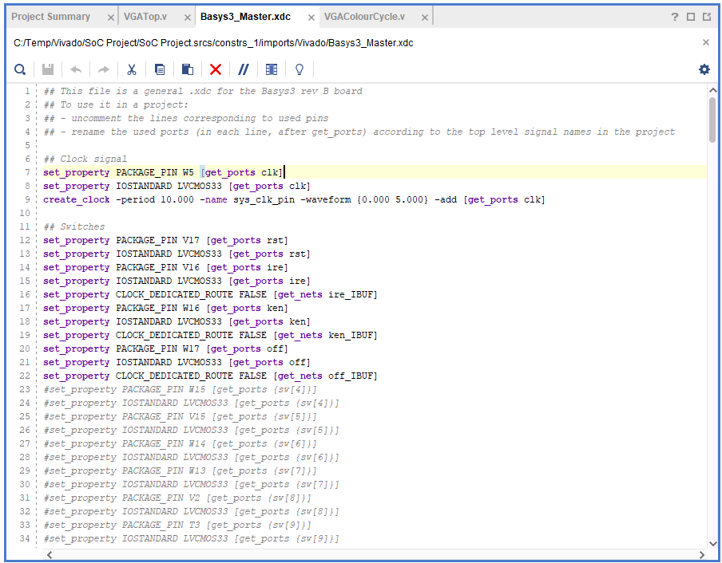

<head>
    <meta name="viewport" content="width=device-width, initial-scale=1.0">
    <title>SoC Project GitPage</title>
    <link rel="stylesheet" href="styles.css">
</head>

<body>
    <header>
        <h1>SoC Project GitPage</h1>
        <nav>
            <ul>
                <li><a href="#code">Coding</a></li>
                <li><a href="#demo">Demo</a></li>
                <li><a href="#dev">Development</a></li>
            </ul>
        </nav>
    </header>

    <section id="code">
        <h2>Coding</h2>
        
The basis of he code for this project was gathered from my previous labs in SoCD. The code given to us was to display several coloured lines across the screen. I addapted the code given to us for my project. The aim of this code is to display different flags depending on which switch is on. You can see in the if loops that it counts the pixels across the screen and makes them all one color. It repeats this until the screen is filled with coloured pixels. In the case of the Kenyan flag, instead of it counting the pixels across the screen, it counts the pixels down the screen because the lines are horizontal. 
 
        
        
After making the loops to display the flags, I had to research how to configure the switches correctly. After failing to configure the switch, the terminal in Vivado recommended using the constraint <b>"set_property CLOCK_DEDICATED_ROUTE FALSE [get_nets ire_IBUF]"</b>. This allowed the switches to work as intended.

        
    </section>

    <section id="demo">
        <h2>Demonstration</h2>
        
To demonstrate that the program is working as intended I have to show that the screen is displaying the flags in their intended order. The first switch is the Irish flag, the second is the Offaly flag, and the third is the Kenyan flag. It may be difficult to see in the photos but they are working as intended.

        

            
            
            
        

        
A way to more clearly display the code functioning as intended is by using the simulation and testbench. The below images will show the code used to configure the testbench and the simulation in progress. You can see in the simulation that when the switches are engaged, the RGB is activated. This shows that the switches are properly activating and triggering the display.

        

            
            
        

    </section>

    <section id="dev">
        <h2>Development</h2>
        
During the course of this project, there were many missunderstandings and errors made. Learning from those mistakes and missunderstandings developed my understanding of verilog as a whole. What the biggest problem for me was in the process of developing my project was the configuration of the switches. When I initially configured the switches, they were being missconstrued by the system as clocks. After researching online and then using AI, the terminal in Vivado recommended that I used the constraint <b>"set_property CLOCK_DEDICATED_ROUTE FALSE [get_nets ire_IBUF]"</b>. This fixed my errors and let the switched as intended. The development of this GitPage was aided by the use of AI, giving me a base template for a web page that I could fill in with all of my information and images.

    </section>

    <footer>
        
Copyright © 2024 Mark

    </footer>
</body>
